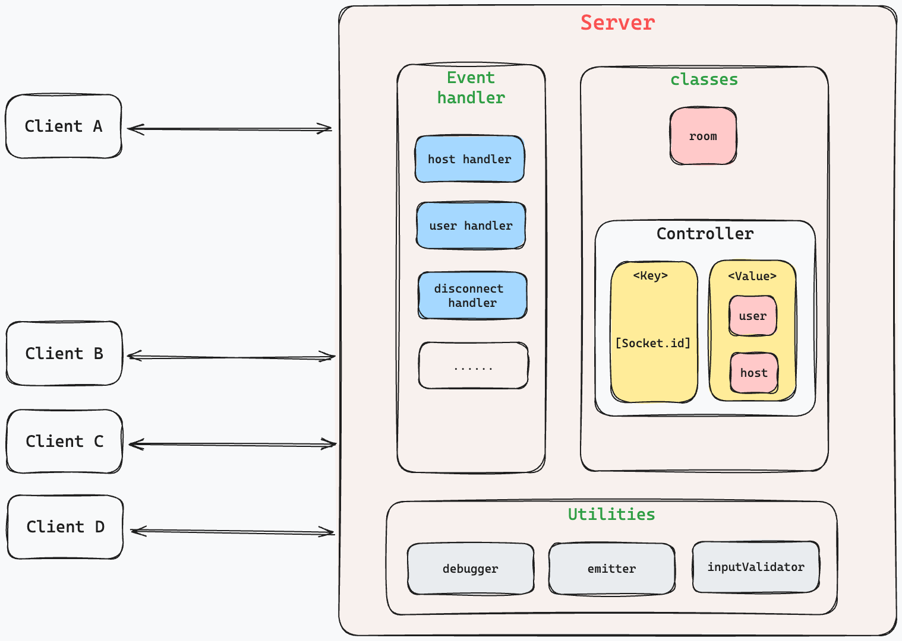

<!--  -->

# Usage Example:

The following are the services that the server currently provides:

**NOTES:**

-   The server will emit an event with the same name as the one sent by the client.

## Serivces of the Server

```javascript
/**
 * Create a new user
 * @param void
 * @return {Object} - { result: "success", { status: "pending" } }
 * @return {Object} - { result: "error", message: string }
 */
socket.on("host:create", () => {...})

/**
 * Create a new room
 * @params {Object} - { roomId: string }
 * @return {Object} - { result: "success", { roomId: string } }
 * @return {Object} - { result: "error", message: string }
 */
socket.on("host:create:room", ({ roomId }) => {...})

/**
 * Close the room and remove all users from the room
 * @params void
 * @return {Object} - { result: "success", { roomId: string } }
 * @return {Object} - { result: "error", message: string }
 */
socket.on("host:close:room", () => {...})

/**
 * Create a new user
 * @params {Object} - { name: string }
 * @return {Object} - { result: "success", { name: string, status: "pending" } }
 * @return {Object} - { result: "error", message: string }
 */
socket.on("user:create", ({ name }) => {...})

/**
 * Join a room
 * @params {Object} - { roomId: string }
 * @return {Object} - { result: "success", { roomId: string, message: string } }
 * @return {Object} - { result: "error", message: string }
 */
socket.on("user:join:room", ({ roomId }) => {...})

/**
 * Leave the room
 * @params void
 * @return {Object} - { result: "success", { roomId: string, message: string } }
 * @return {Object} - { result: "error", message: string }
 */
socket.on("user:leave:room", () => {...})
```

<!-- ### For Users: -->

<!-- 1.  `user:create`: When the user clicks a button to select as a **player** and passing userName parameter, the client-side can emit this event. Once the server receives the event, it will create a new user and return the new user ID to the client. No matter success or failure, the server will emit the event with results back to the client. `socket.emit('user:create', results)`, the client can listen to the event with `socket.on('user:create', (results) => {...})`. -->

<!-- ```javascript
// Step1. [client-side]
socket.emit("user:create", { userName: "John Doe" })

// Step2. [server-side]
// Server receives the event and call the referece function (createUser)
socket.on("user:create", createUser)

// Step3. [server-side]
// After executed the createUser function, server emits the event with results back to the client
socket.emit("user:create", results)

// Step4. [client-side]
// Client listens to the event and handles the results
socket.on("user:create", results)

// Note: Results can be either success or error
// Error Response
{
    "result": "error",
    "message": "Please provide a name" || "User name ${socket.id}, is already a user."
}

// Success Response
{
    "result": "success",
    "response": {
        userId: newUser.id,
    },
}
``` -->

<!-- 2.  `user:join:room`: After the user is created (meaning the socket ID that emits `user:create` has been registered as a user), call this event to join a room by giving **roomId** parameter. The server will join the user to the room and return the room ID to the client. -->

<!-- ```javascript
// Step1. [client-side]
socket.emit("user:join:room", { roomId: "8123" })

// Step2. [server-side]
// Server receives the event and call the referece function (joinRoom)
socket.on("user:join:room", joinRoom)

// Step3. [server-side]
// After executed the joinRoom function, server emits the event with results back to the client
socket.emit("user:join:room", results)

// Step4. [client-side]
// Client listens to the event and handles the results
socket.on("user:join:room", results)

// Note: Results can be either success or error
// Error Response
{
    "result": "error",
    "message": "error msg..."
}

// Success Response
{
    "result": "success",
    "response": {
        roomId: roomId,
    },
}
``` -->

<!-- ### For Hosts:

1. `host:create`: When the user clicks a button to select as a **host**, the client-side emit this event. Once the server receives the event, it will create a new host and return the new host ID to the client.

    ```javascript
    // Error Response
    {
        "result": "error",
        "message": "The socket ID: ${socket.id}, is already a host."
    }

    // Success Response
    {
        "result": "success",
        "response": {
            hostId: host.id,
        },
    }
    ``` -->

<!-- 2. `host:create:room`: After the host is created (meaning the socket ID that emits `host:create` has been registered as a host), call this event to create a new room by giving **roomId** parameter. The server will create a room and return the room ID to the client.

    ```javascript
    // Step1. [client-side] (host only)
    socket.emit("host:create:room", { roomId: "8123" })

    // Step2. [server-side]
    // Server receives the event and call the referece function (createRoom)
    socket.on("host:create:room", createRoom)

    // Step3. [server-side]
    // After executed the createRoom function, server emits the event with results back to the client
    socket.emit("host:create:room", results)

    // Step4. [client-side]
    // Client listens to the event and handles the results
    socket.on("host:create:room", results)

    // Note: Results can be either success or error
    // Error Response
    {
        "result": "error",
        "message": "error msg..."
    }

    // Success Response
    {
        "result": "success",
        "response": {
            roomId: roomId,
        },
    }
    ``` -->

---

### TODO:

-   Implement APIs (func) of server object that can be used for instances of classes.
-   Update REAMDME.md with the latest information. (new events... etc.)
-   Research webpage refresh flushing socket.io connection.
